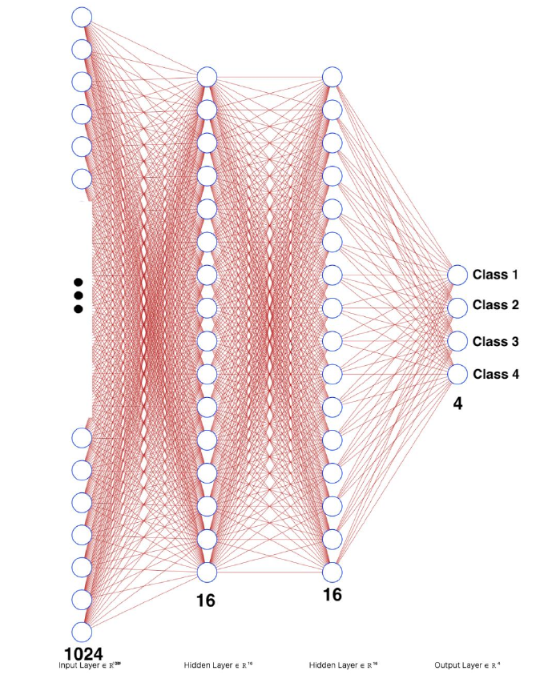

# ANN-Project (CIFAR-10 Classification)
Learning 4 types (`selected_types = ['airplane', 'automobile', 'bird', 'cat']`) of objects with a fully connected neural network.

## Dataset
The [CIFAR-10](https://www.cs.toronto.edu/~kriz/cifar.html) dataset consists of 60000 32x32 colour images in 10 classes, with 6000 images per class. There are 50000 training images and 10000 test images.

## Preprocessing
* Making grayscale
* Normalizing

## Feed Forward
$$a^{(L+1)} = \sigma(W^{(L+1)}× a^{(L)} + b^{(L+1)})$$  

  

  
 

## Backpropagation
$$Cost =\sum_{j=0}^{n_{L} - 1} (a_{j}^{(L)} - y_{j})^2$$
$$(W, b) = (W, b) - \alpha\nabla Cost$$

## Vectorization

$$Cost =(\overrightarrow{a}^{(3)} - \overrightarrow{y})^{T}(\overrightarrow{a}^{(3)} - \overrightarrow{y})$$
$$\overrightarrow{a}^{(3)} = \sigma(\overrightarrow{z}^{(3)})$$
$$\overrightarrow{z}^{(3)} = W^{(3)}\overrightarrow{a}^{(2)} + \overrightarrow{b}^{(2)}$$

## Optional Items 

* Convolutional Model
* Data Augmentation

 

# Resources
This [repository](https://github.com/SoroushMehraban/Handwritten-Digit-Recognition) can give you a lot of knowledge about NN classification implementations.