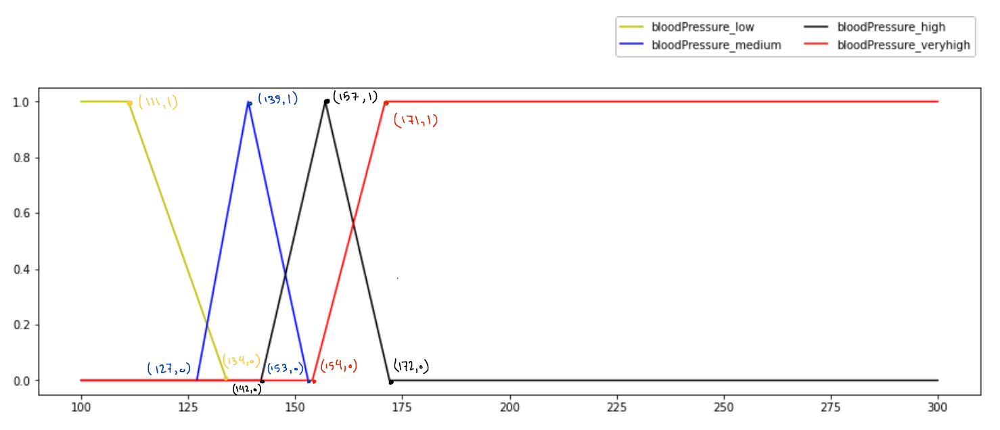

# Heart Disease Fuzzy Intelligent System

## Running the program
Implementing a fuzzy intelligent system that can decide whether a person has a heart problem or not and at what grade is the problem.

```
python3 -m venv env
source env/bin/activate
pip3 install -r requirements.txt
python3 app.py
```

Then the app is running on: `http://127.0.0.1:8448/ `


## Input Parameters & Fuzzification

- ### Age 
  Age of the patient in range of [0,100]

  

- ### Blood Pressure
  
  Blood pressure in range of [0, 350]
  
  

- ### Cholesterol
  
  Amount of cholesterol in range of [0, 600]
  
  

- ### Blood Sugar
  
  Amount of blood sugar in range of [0, 200]
  
  

- ### ECG
  
  A simple test that can be used to check your heart's rhythm and electrical activity. Its value is in range of [-0.5, 2.5]
  
  

- ### Maximum Heart Rate
  
  Maximum heart rate of the patient in past 24 hours in range of [0, 600].
  
  

- ### Exerciese
  
  A crisp set inidicating that exercise is allowed for the patient or not. If it has 0 value it means that exercise is not allowed for the patient and vice verca for 1 value.
  

- ### Old Peak
  
  Degree of oldpeak in range of [0,10].
  
  

- ### Thallium
  
  Amount of thallium in patient's body which can be 3 crisp values. (3, 6, 7)
  

- ### Sex
  
  Sex of the patient. 1 for women and 0 for men.
  

## Output Fuzzysets

We have one output parameter which is the health of the patient. It has 5 fuzzysets containing healty, sick1, sick2, sick3 and sick4.


## Rules

There is a [file](rules.fcl) cotaining all rules of the inference engine. The rules can only contain and/or operators.
