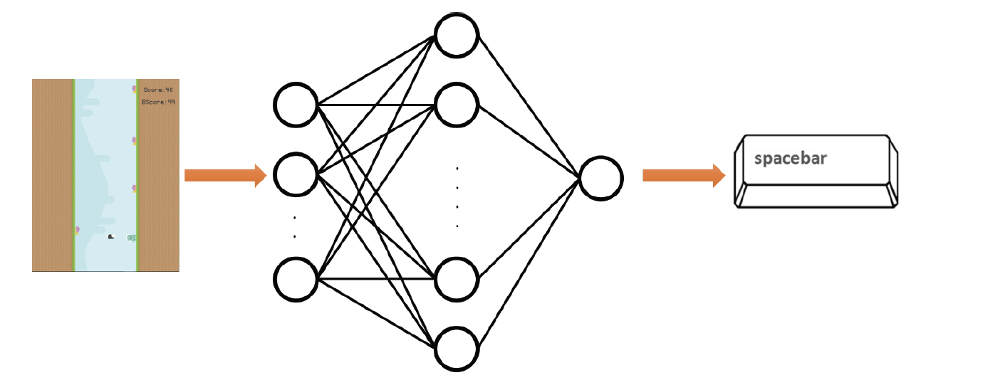

# Snail jumper

**Neuroevolution game assignment.**  
**Spring 2022 - Computer Intelligence.**  

This game has been developed as an assignment for students at Amirkabir University of Technology to apply neuroevolution using a simple game.  

## Game Modes
* Manual  
* Neuroevolution

## Design
  
We design a neural network that takes important decision-making parameters under input and then generates the corresponding output.

At the end, the produced output is similar to pressing the space button defined in the game. 

## Input Vector
We build the input vector based on the `player_x` and `player_y` position and position of `obstacales` and `screen_width` and `screen_height`.

## Neural Network Part
We have following activation function:

* sigmoid
* relu
* leaky_relu
* tanh
* softmax
* linear

And our neural network has three layers:

* input layer
* one hidden layer
* output layer

## Evolution Part
In the evolution part we design the desired steps.

For the `next_population_selection` part we have the following options:

* Roulette Wheel Selection
* Stochastic Universal Sampling
* Q Tournament, in case of 2: binary tournament

# Saving the results
The results are saved to `result_file = 'generation_results.csv'`, and you can see the learning curve by opening `plot-results.ipynb` notebook.